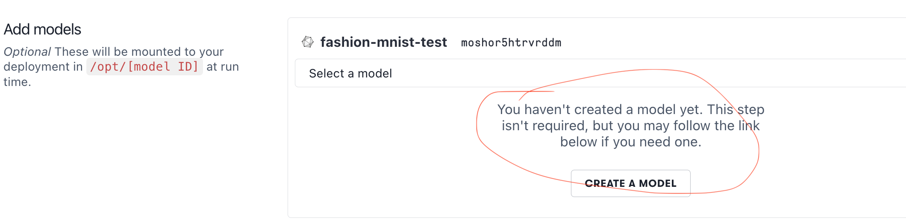

# paperspace-test
Repo to test out paperspace platforms

## Paperspace Notes: 
- Video+ Tutorial slightly older but still works. 
- All deployments come with `/healthcheck`
- Models to be Uploaded and path to be specified as `/opt/models/<model_file_name>`
- TF, Onnx models supported out of box; also has custom option

## Paperspace Questions during setup:
- Where did we provide the metadata for the [model](https://youtu.be/voyqmlYOIH0?feature=shared&t=266)

- Check the image below this is slightly confusing. 

- New UI changes breaks the old demo.
    - `<endpoint>/v1/models/fashion-mnist/metadata` does not seem to work, tried my model name, model id and deployment name as well.
    - Tried a `CLI` deployment with `cli-fashion-deply-spec.yaml` worked as expected on metadata and prediction
    - Updated the `path:"/opt/mosqqhgydnbf3wu"` to `path:"/opt/models/fashion-mnist"` in `paperspace.json` to `modif_config_paperspace.json` and uploaded this new config in deployment and everything works again. 

- Will disabling the deployment stop the billing? (i doubt it)

## Using HF-FastAPI-Paperspace Template
- Base image is large, taking a lot of time to build locally
- Custom docker image creation instructions not super clear
    - Faced issues in pushing images to docker hub and pulling them to paperspace
    - `containerRegistry` in config yaml to be added with value as given from console -> team setting -> containers
    - Update [readme](https://github.com/Paperspace/deploy-action/tree/v1.3) with 2 changes
        - `v1.2` -> `v1.3`
        - `configPath` explanation, how does the runner find `paperspace.json` file.
    - This [link](https://docs-next.paperspace.com/deploying/app-config) helped
- Slightly unpredictable boot times, better logging can help?
    - Got an email it could be multiple issues and reported to paperspace 
    - again failed on 30th oct 10:30 PM IST with error `[unknown] Volume creation timed out`
- HF login seems to be failing in Notebooks
- Tensorboard was not coming up using [this link](https://docs.paperspace.com/gradient/notebooks/tensorboard/#how-to-configure-a-tensorboard-in-gradient-notebooks)
    - had to install `pygments`
    - my [tensorboard url](https://tensorboard-nl9d5a3r0k.clg07azjl.paperspacegradient.com/)